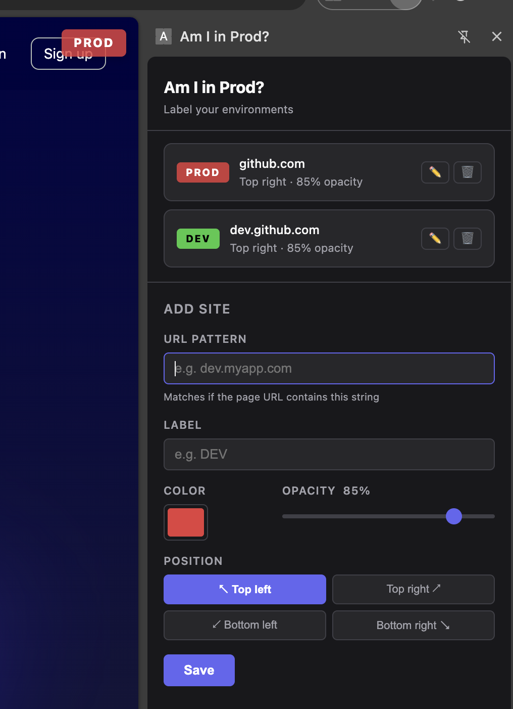

# Am I in Prod?

A Chrome extension that shows a colored environment label (e.g. `DEV`, `STAGING`, `PROD`) on top of any webpage whose URL matches a pattern you configure — so you never mistake one environment for another.

> **Not published on the Chrome Web Store.** Install it manually as an unpacked extension (see below).

## Features

- **Custom URL rules** — match any site by a substring of its URL (e.g. `dev.myapp.com`).
- **Custom labels** — set any text label per rule (e.g. `DEV`, `STAGING`, `PROD`, `DANGER`).
- **Custom color & opacity** — pick a badge color and adjust its opacity; text color (black/white) is chosen automatically for contrast.
- **Configurable position** — pin the label to any corner of the page (top-left, top-right, bottom-left, bottom-right).
- **Side panel manager** — add, edit, and delete rules from the extension's side panel, with a live preview of each configured site.
- **Live updates** — labels update automatically on the page as soon as rules change, no reload required.
- **Synced storage** — rules are stored via `chrome.storage.sync`, so they follow you across devices signed into the same Chrome profile.

## Installation

Since this extension isn't on the Chrome Web Store, load it manually in developer mode:

1. Download or clone this repository to a local folder.
2. Open Chrome and navigate to `chrome://extensions`.
3. Enable **Developer mode** (toggle in the top-right corner).
4. Click **Load unpacked**.
5. Select the folder containing this repository (the one with `manifest.json`).
6. The "Am I in Prod?" extension should now appear in your extensions list.

## Usage

1. Click the extension icon in the toolbar to open the side panel.
2. Click **Add site** and fill in:
   - **URL pattern** — a substring to match against the page URL (e.g. `dev.myapp.com`).
   - **Label** — the text shown on the badge (e.g. `DEV`).
   - **Color** and **Opacity** — how the badge looks.
   - **Position** — which corner of the page the badge appears in.
3. Click **Save**. Any open tab whose URL matches the pattern will immediately show the label.
4. Edit or delete existing rules from the list using the ✏️ and 🗑️ icons.

## How it works

- `content.js` runs on every page, checks the current URL against your saved rules, and injects a fixed-position badge when there's a match.
- `sidepanel.html`/`sidepanel.js`/`sidepanel.css` implement the rule management UI shown in the side panel.
- `background.js` opens the side panel when the toolbar icon is clicked.
- Rules are persisted with `chrome.storage.sync` and shared live between the side panel and content script via `chrome.storage.onChanged`.
